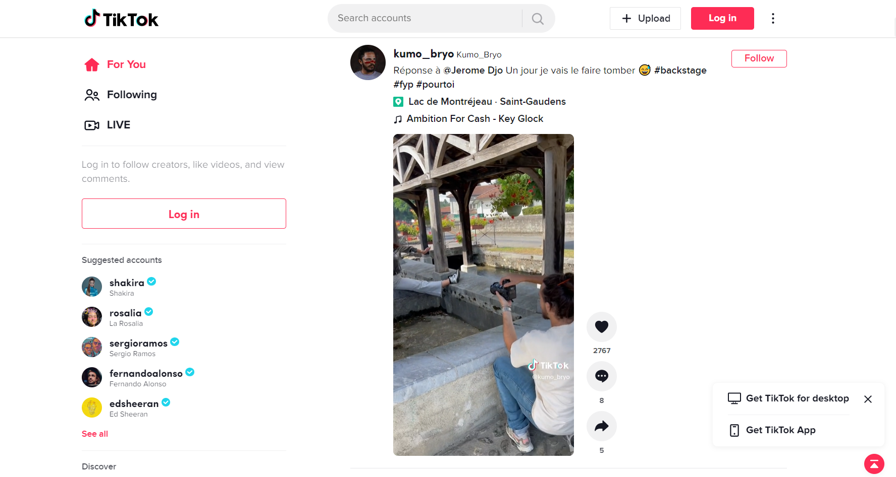
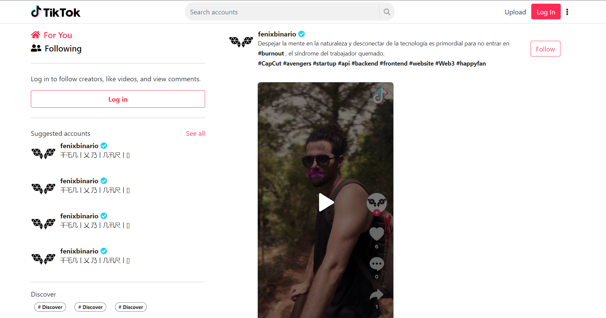

# TikTok-WebSiteclone
## Description
Tik Tok Web Site Clone with html5 and Boostrap
### Visit WebSite
[TikTokClone](https://fenixbinario.github.io/TikTok-WebSiteclone)

### Clone repository

```bash
    git clone https://github.com/fenixbinario/TikTok-WebSiteclone.git
```

## TO DO:
- [x] Desktop Version --> Future
- [ ] Mobile Version --> Future
- [ ] Profile Page --> Future
- [ ] Video Page --> Future

## SCREENSHOT ORIGIN

## SCREENSHOT CLONE

